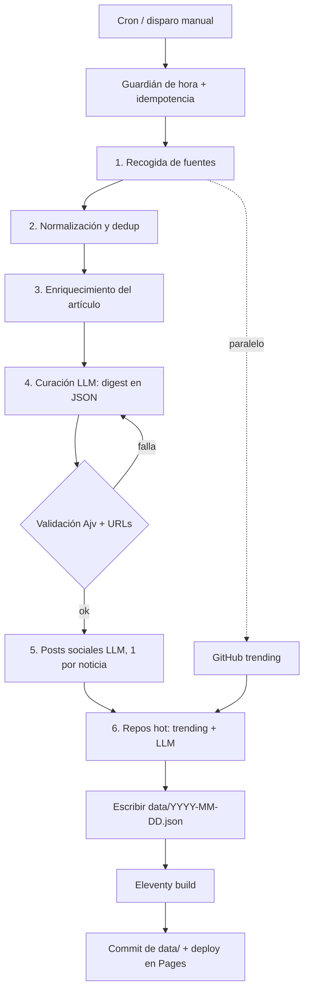

# Flujo técnico de creación de las noticias

Documento técnico del proceso que convierte fuentes RSS, la API de Hacker News y las tendencias de GitHub en la edición diaria publicada. Describe cada paso, el archivo que lo implementa y las decisiones de diseño relevantes.

## 1. Visión general

El proyecto es un sitio estático: no hay servidor ni base de datos. Un workflow de GitHub Actions ejecuta cada mañana un único orquestador (`pipeline/index.ts`), que produce un JSON por edición en `data/YYYY-MM-DD.json`. Eleventy transforma esos JSON en HTML y GitHub Pages lo sirve.

El modelo de lenguaje (DeepSeek por defecto) se usa como un paso más del script, con prompts fijos en `prompts/` y salida validada contra un JSON Schema. Nunca se le deja inventar datos duros como las URL.



## 2. Disparo y planificación

Fichero: `.github/workflows/daily.yml`.

- **Crons.** GitHub solo entiende UTC, y España cambia de hora, así que se disparan dos veces: `9 7 * * *` (09:09 CEST en verano) y `9 8 * * *` (09:09 CET en invierno).
- **Guardián de hora.** El paso `guard` calcula la hora en `Europe/Madrid` y solo deja continuar (`run=true`) si son las 09:00 o más. Un disparo manual (`workflow_dispatch`) se ejecuta sin comprobar la hora.
- **Idempotencia.** El orquestador aborta pronto si ya existe `data/<hoy>.json` (ver paso 7). El commit de la edición solo se crea si hay cambios en `data/`, así que dos crons el mismo día no publican dos veces.
- **Entrada manual `skip_pipeline`.** Reconstruye y despliega el sitio sin regenerar la edición (salta el paso del pipeline y va directo al build).
- **Permisos y concurrencia.** El job pide `contents: write`, `pages: write`, `id-token: write` e `issues: write`, y usa un grupo de `concurrency` para no solaparse consigo mismo. Si algún paso falla, un paso final abre un issue con enlace al run.

## 3. Configuración

Ficheros: `config/sources.json` y `pipeline/config.ts`.

`config.ts` solo lee y parsea el JSON (`loadConfig()`), sin validación estricta: el tipo `SourcesConfig` de `pipeline/types.ts` documenta la forma esperada. Campos globales relevantes:

| Campo | Uso |
|---|---|
| `window_hours` | Ventana temporal de recogida (24 h por defecto). |
| `candidate_cap` | Máximo de candidatos que pasan a curación tras normalizar. |
| `enrich_top` | Cuántos candidatos con más señal se enriquecen leyendo el artículo. |
| `timeout_ms`, `enrich_timeout_ms` | Timeouts de red. |
| `user_agent` | User-Agent identificable en todas las peticiones. |

Cada fuente RSS tiene `enabled` y `fragile` (una fuente frágil que falla se ignora sin contar como incidencia). Los bloques `hackernews`, `huggingface_trending` (desactivado) y `github_trending` configuran las fuentes que no son RSS.

## 4. Paso 1: Recogida

Ficheros: `pipeline/sources/index.ts` (orquestador), `pipeline/sources/rss.ts`, `pipeline/sources/hackernews.ts`, `pipeline/sources/huggingface.ts`, `pipeline/http.ts`.

`collectAll()` construye la lista de tareas a partir de las fuentes habilitadas y las ejecuta en paralelo con `Promise.allSettled`. Tolerancia a fallos:

- Una fuente que falla se registra y se omite.
- Solo se considera fatal si fallan **todas** (el orquestador aborta en ese caso, ver paso 7).
- Las fuentes marcadas `fragile` (por ejemplo el mirror no oficial de Anthropic) se registran con un aviso más suave.

Cada fuente devuelve `NewsItem[]` normalizados al formato común `{ title, snippet, url, source, published_at, points?, content? }`. El XML se descarga con `fetchText` (User-Agent y timeout propios) y solo se parsea con `rss-parser`. Hacker News usa su API pública filtrando por `min_points` y por una lista de queries.

La recogida de tendencias de GitHub es una llamada aparte, no forma parte de `collectAll`, porque su salida no son noticias sino repositorios (ver paso 6).

## 5. Paso 2: Normalización

Fichero: `pipeline/normalize.ts`.

- **`canonicalUrl()`** canonicaliza cada URL para deduplicar: quita el fragmento `#...`, los parámetros de tracking (`utm_*`, `ref`, `fbclid`) y la barra final.
- **Deduplicación.** Se agrupa por URL canónica en un `Map`. En una colisión se conserva el primer ítem, pero hereda la mayor puntuación disponible y el `snippet` si le faltaba.
- **Orden por señal.** Primero por puntos de Hacker News (descendente), y a igualdad, por fecha de publicación más reciente.
- **Cap.** Se recorta a `candidate_cap` para acotar el tamaño del prompt de curación.

## 6. Paso 3: Enriquecimiento

Fichero: `pipeline/enrich.ts`.

Para los primeros `enrich_top` candidatos (ya ordenados por señal), se descarga la página real y se extrae texto legible, de modo que el resumen no dependa solo del titular.

- **`extractReadable()`** toma la meta descripción (`og:description` o `description`) más los primeros párrafos largos (mínimo 60 caracteres), hasta un tope de 1200 caracteres.
- **Concurrencia.** Un pool de 6 workers procesa los objetivos en paralelo.
- **Tolerante a fallos y paywalls.** Si la respuesta no es HTML, da error o el texto extraído es demasiado corto, ese ítem se queda sin `content` y se seguirá usando su `snippet`. Si no se lee ningún artículo, se registra un aviso pero el pipeline continúa.

## 7. Paso 4: Curación

Ficheros: `pipeline/curate/index.ts`, `prompts/curacion.md`, `pipeline/validate.ts`, `schema/digest.schema.json`.

Antes de llamar al modelo, el orquestador (`pipeline/index.ts`) comprueba dos condiciones de salida temprana:

1. **Idempotencia.** Si existe `data/<hoy>.json`, no hace nada.
2. **Sin credencial.** Si el proveedor no tiene su API key, no es un error: se conserva la última edición y el sitio se reconstruye igualmente.

Si hay menos de 6 ítems normalizados, se aborta sin publicar.

`curate()` hace lo siguiente:

- Lee el prompt de sistema `prompts/curacion.md` (rol de editor jefe, criterio de priorización con la IA como eje dominante y lo práctico por delante de lo financiero).
- Construye el prompt de usuario con los ítems y las cabeceras (`buildUserPrompt`). Las URL se listan literalmente para que el modelo las copie sin modificarlas.
- Llama al proveedor pidiendo salida en JSON.
- Fuerza `date`, `generated_at` y `provider` desde el propio script (`coerceMeta`), no desde el modelo.
- **Valida** con `validateDigest()`: primero contra el JSON Schema (Ajv), y después dos comprobaciones fuera del schema: cada `url` del digest debe existir en las URL de entrada (el modelo elige, nunca inventa), y los `rank` no pueden repetirse.
- **Reintentos.** Hasta 3 intentos (1 más 2 reintentos). Si un intento no valida, se inyecta el error concreto en el prompt y se reintenta. Si tras los reintentos sigue sin validar, lanza y el pipeline aborta (exit distinto de 0).

## 8. Paso 5: Posts sociales

Ficheros: `pipeline/curate/social.ts`, `prompts/social.md`.

Tras una curación válida, `attachSocial()` genera el texto para X y LinkedIn. Es **best effort**: si falla, la edición se publica sin posts.

- **Una llamada por noticia**, en paralelo acotado (lotes de 5, `mapPool`). El fallo es granular: si una noticia falla, las demás igual obtienen sus posts.
- El modelo devuelve, por noticia, `hook_x`, `hook_linkedin` y `hashtags`. El gancho va como primera línea (lo que frena el scroll).
- **Ensamblado para X** (`assembleX`): texto plano (las letras Unicode en negrita cuentan doble en X). El gancho es el post; si no cabe en 280 contando la URL como 23, primero se sueltan los hashtags y luego se recorta el gancho.
- **Ensamblado para LinkedIn** (`assembleLinkedIn`): sin límite práctico. El gancho abre y la idea clave marcada por el modelo con `**...**` se convierte a negrita Unicode (`applyBold`, `boldSans`), porque LinkedIn no renderiza markdown.

## 9. Paso 6: Repositorios hot

Ficheros: `pipeline/sources/github.ts`, `prompts/repos.md`, `pipeline/curate/repos.ts`.

Sección independiente de las noticias, también **best effort**.

- **Recogida** (`collectGithubTrending`): intenta el scraping de `github.com/trending` (`parseTrending` extrae owner/repo, descripción, lenguaje y estrellas de cada `article.Box-row`). Si falla, cae a la Search API oficial (`created:>hace 7 días`, ordenado por estrellas), usando `GITHUB_TOKEN` si está disponible. Si todo falla, devuelve lista vacía y la sección no aparece.
- **Selección y descripción** (`attachRepos`): una tercera llamada al modelo (prompt `prompts/repos.md`) que elige los repos más interesantes para el diario (IA y herramientas prácticas primero) y los describe en castellano. Los datos duros (nombre, URL, lenguaje, estrellas) se toman **siempre** del repo recogido, no de la respuesta del modelo; del modelo solo se usa la descripción. El resultado se guarda en `digest.repos`.

## 10. Paso 7: Render y publicación

Ficheros: `pipeline/index.ts`, `eleventy.config.mjs`, `site/_data/editions.js`, `site/_includes/`, `site/*.njk`.

- El orquestador escribe `data/YYYY-MM-DD.json` con `writeFileSync`.
- **Eleventy** (`npm run build`) lee todas las ediciones vía `site/_data/editions.js`, que ordena los ítems de cada edición por `rank`, ordena las ediciones de más reciente a más antigua y calcula número, rutas y vecinos.
- Las plantillas Nunjucks (`site/_includes/edicion.njk` para la edición, `archivo.njk` para el histórico) renderizan el destacado (`items[0]`), la rejilla de noticias y la sección de repos. `eleventy.config.mjs` aporta los filtros de fecha en español.
- **Publicación.** El workflow hace `git add data/`, crea el commit de la edición solo si hay cambios, y despliega `_site` en GitHub Pages.

## 11. Proveedores de modelo

Ficheros: `pipeline/curate/index.ts`, `pipeline/curate/deepseek.ts`, `pipeline/curate/claude-code.ts`.

- **DeepSeek** (por defecto): endpoint compatible con el formato de OpenAI, JSON mode, `temperature` 0.3 y timeout amplio (v4-pro razona y puede tardar). Modelo configurable con `DEEPSEEK_MODEL`.
- **claude-code** (fallback): invoca el CLI de Claude Code en modo headless vía suscripción. No probado end to end.
- La interfaz común es `Provider.generate(systemPrompt, userPrompt): Promise<string>`. `resolveProviderName()` elige según `LLM_PROVIDER`, y `providerCredentialPresent()` permite saltar sin fallar si no hay credencial.

## 12. Esquema de datos y tipos

Ficheros: `schema/digest.schema.json`, `pipeline/types.ts`.

El digest tiene `date`, `generated_at`, `provider`, un array `items` (de 6 a 20 noticias, con `rank`, `category`, `title`, `summary`, `why_it_matters`, `url`, `source` y `social` opcional) y un array opcional `repos`. Los campos `social` y `repos` se rellenan **después** de la validación del schema, igual que se documenta para las noticias.

## 13. Tolerancia a fallos

| Situación | Comportamiento |
|---|---|
| Una fuente falla | Se omite; la recogida continúa. |
| Fallan todas las fuentes | Aborta con exit 1. |
| Menos de 6 ítems normalizados | Aborta sin publicar. |
| No se enriquece ningún artículo | Aviso; se usan los snippets. |
| Curación no valida tras 3 intentos | Aborta con exit 1. |
| Posts sociales fallan | La edición se publica sin posts. |
| Repos hot fallan (scraping y API) | La edición se publica sin la sección. |
| Sin credencial del proveedor | No se genera edición nueva; se conserva la última. |
| Ya existe la edición de hoy | No se hace nada (idempotencia). |

## 14. Ejecución local

```bash
npm install
npm run pipeline -- --collect-only   # imprime los ítems normalizados, sin llamar al modelo
npm test                             # normalización, validación, parser de trending, ensamblado social
npm run typecheck                    # tsc --noEmit
npm run build                        # genera _site/
npm run dev                          # servidor local

# Edición real (requiere credencial):
export DEEPSEEK_API_KEY=sk-...       # PowerShell: $env:DEEPSEEK_API_KEY="sk-..."
npm run pipeline                     # escribe data/<hoy>.json
```
